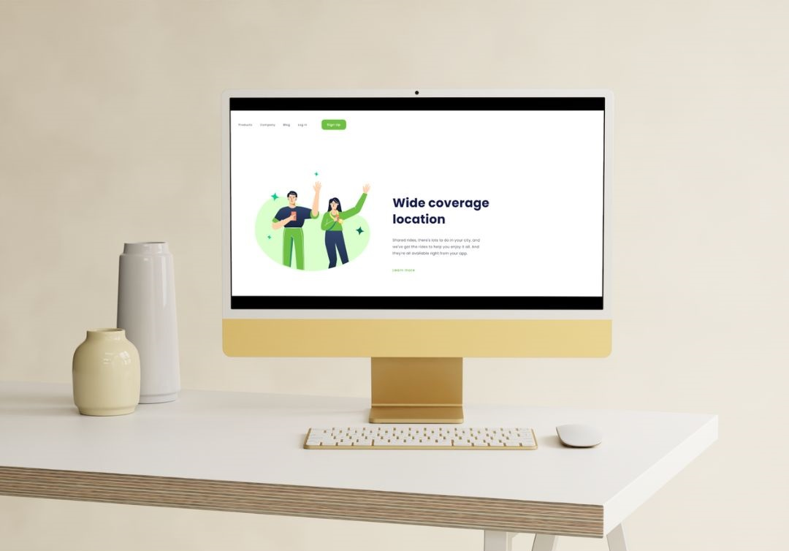
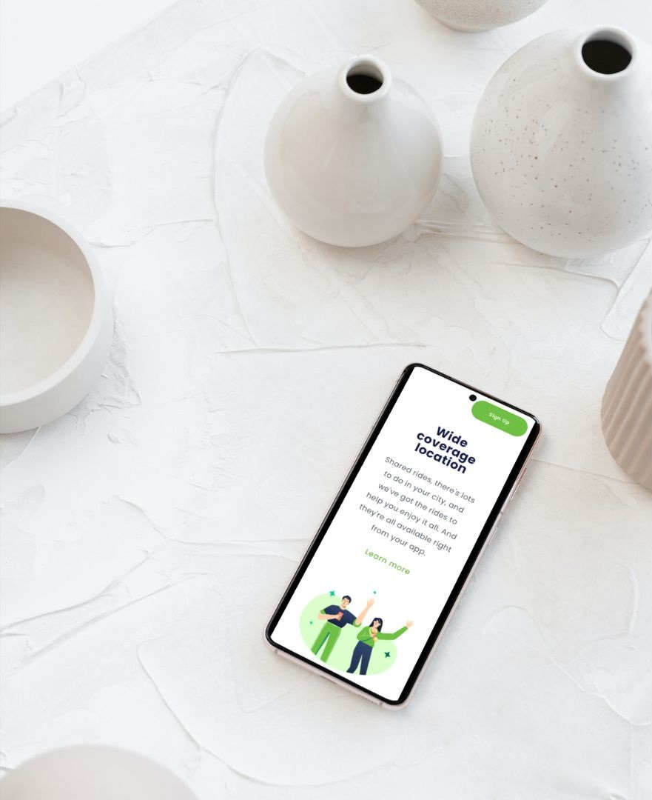

<h1>Project Wide Coverage</h1>

<h2>Wide Coverage is a project that incorporates elements from "We Care" and "Shopping Via Mobile." It boasts responsive design and user-friendly features, adapting seamlessly to various screen sizes, offering an engaging and versatile user experience.</h2> 

## Features

- Responsive design for broad screen coverage.
- User-friendly features inspired by "We Care" and "Shopping Via Mobile."
- Seamless adaptation to various screen sizes.
- Engaging user experience across different devices.

## Technologies Used

- 
- 

## Preview and Link

[Link to Live Demo](https://jhschier.github.io/Project-Wide-Coverage/)

## About

"Wide Coverage" is a project that brings together the best of "We Care" and "Shopping Via Mobile" by offering responsive design and user-friendly features. It ensures a consistent and engaging experience for users on a wide range of screen sizes and devices.
